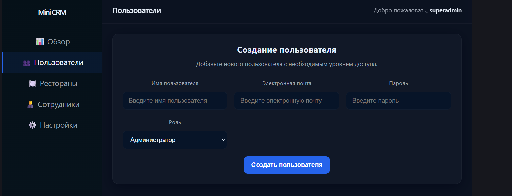
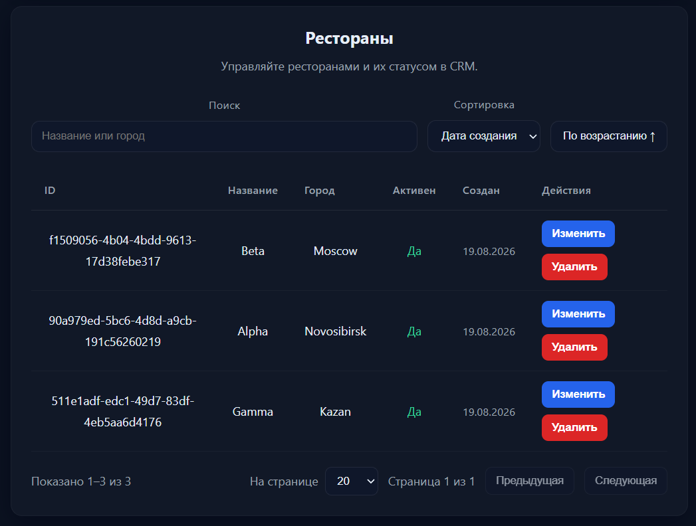
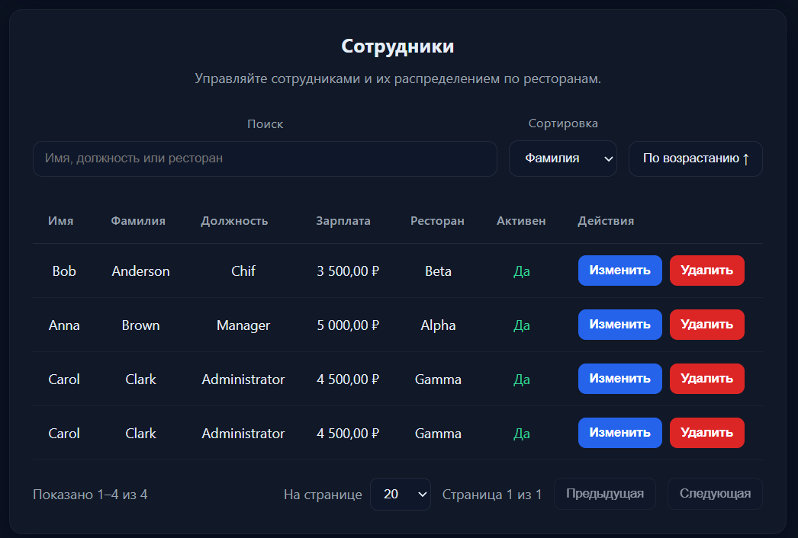
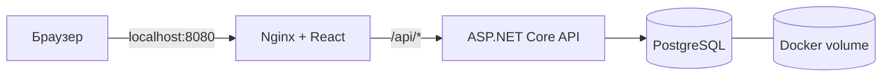

# Mini CRM

Учебная CRM для управления пользователями, ресторанами и сотрудниками. Проект демонстрирует ASP.NET Core Minimal API, PostgreSQL, JWT-авторизацию, бизнес-правила и HTTP-интеграционные тесты. Интерфейс написан на React.

## Возможности

- Роли `Administrator`, `Editor`, `Viewer` с проверкой прав на сервере.
- Просмотр, создание и редактирование пользователей, ресторанов и сотрудников; удаление доступно администратору.
- Поиск, сортировка и постраничное чтение ресторанов и сотрудников.
- Проверка входных данных, уникальность username/email без учёта регистра, запрет удаления ресторана с сотрудниками.
- Отзыв JWT после изменения роли, активности или пароля и после удаления пользователя: текущие данные пользователя сверяются с БД на защищённых запросах.
- Интеграционные HTTP-тесты с временной PostgreSQL-базой и CI для backend/frontend.

JWT хранится в памяти вкладки: после обновления страницы требуется повторный вход.

## Интерфейс

Создание пользователя и выбор роли:



Поиск, сортировка и список ресторанов:



Сотрудники и их связь с ресторанами:



## Стек и архитектура

| Часть | Технологии |
| --- | --- |
| Backend | .NET 10, ASP.NET Core Minimal API, EF Core, JWT Bearer |
| База данных | PostgreSQL 18, миграции EF Core |
| Frontend | React 19, Vite 8, React Router |
| Тесты и CI | xUnit, `WebApplicationFactory`, PostgreSQL, GitHub Actions |
| Контейнеры | Docker Compose, Nginx Unprivileged |



Nginx отдаёт интерфейс и передаёт `/api/*` в backend, снимая префикс `/api`. Backend подключается к PostgreSQL по закрытой сети Compose. Снаружи опубликован только frontend на `127.0.0.1:8080` (или на порту `APP_PORT` из `.env`).

## Быстрый запуск через Docker

Нужны Git и запущенный Docker Desktop с Linux-контейнерами (на Windows — с WSL 2). Команды для PowerShell:

```powershell
git clone --branch feature/frontend-enhancements https://github.com/Vitalii-Bochkarev/mini-crm.git
cd mini-crm
Copy-Item .env.example .env
```

В `.env` замените **все** значения `CHANGE_ME` собственными тестовыми секретами. Пароль в `POSTGRES_PASSWORD` и `BACKEND_CONNECTION_STRING` должен совпадать; имена БД и пользователя в строке подключения — соответствовать `POSTGRES_DB` и `POSTGRES_USER`. Для пароля БД используйте случайную строку от 24 символов, для JWT-ключа — от 32 UTF-8 байт. Не публикуйте `.env`.

```powershell
docker compose config --quiet
docker compose up --build -d --wait
docker compose ps
```

Откройте [http://localhost:8080](http://localhost:8080). При первом запуске backend применяет миграции и создаёт пользователей, если таблица `AdminUsers` пуста:

| Логин | Роль | Состояние | Пароль |
| --- | --- | --- | --- |
| `superadmin` | Administrator | активен | `SEED_SUPERADMIN_PASSWORD` из `.env` |
| `jdoe` | Editor | активен | `SEED_EDITOR_PASSWORD` из `.env` |
| `asmith` | Viewer | отключён | `SEED_VIEWER_PASSWORD` из `.env` |

Для входа используйте `superadmin`. Seed-пароли действуют только при создании пользователей: изменение `.env` позже не обновит существующие записи. Смена `POSTGRES_PASSWORD` после первой инициализации volume также не меняет пароль пользователя БД.

Проверки запущенного проекта: [Nginx](http://localhost:8080/nginx-health), [процесс API](http://localhost:8080/api/health/live), [API и PostgreSQL](http://localhost:8080/api/health/ready). Остановить контейнеры с сохранением данных:

```powershell
docker compose down
```

Повторный `docker compose up -d --wait` поднимет данные из named volume. `docker compose down -v` удалит volume и все данные этой Docker-базы. Docker-база отдельна от локальной БД `adminpanel`.

## API и права

| Маршрут | Назначение |
| --- | --- |
| `POST /auth/login` | Вход и выдача JWT |
| `/admin/users`, `/admin/users/{id}` | Пользователи |
| `GET /admin/overview` | Сводные данные |
| `/restaurants`, `/restaurants/{id}` | Рестораны |
| `/employees`, `/employees/{id}` | Сотрудники |
| `GET /restaurants/{restaurantId}/employees` | Сотрудники ресторана |

Для защищённых маршрутов передавайте `Authorization: Bearer <JWT>`. Чтение доступно трём ролям, создание и редактирование — Administrator и Editor, удаление — Administrator. Дополнительно Editor не может создавать или редактировать Administrator, менять роли и активность, менять чужой пароль; удалить себя не может и Administrator. Неактивный пользователь не может войти.

Списки ресторанов и сотрудников принимают `search`, `page`, `pageSize`, `sortBy`, `sortDirection` (`desc` — убывание). `pageSize` ограничен диапазоном 1–100. Ответ содержит `items`, `totalCount`, `page`, `pageSize`, `totalPages`, `hasNext`, `hasPrevious`. Сортировка ресторанов: `name`, `city`, `createdAt`; сотрудников: `firstName`, `lastName`, `position`, `salary`.

Swagger UI доступен на `/swagger` при запуске backend в среде `Development`. В Compose используется `Production`, поэтому Swagger там выключен.

## Разработка и тесты

Для запуска без Docker понадобятся .NET SDK 10, Node.js 24 и PostgreSQL. Настройте строку подключения, JWT-ключ и seed-пароли backend вне Git. При старте backend выполняет `Database.Migrate()` — указывайте только предназначенную для разработки БД. Локальный адрес API для Vite задан в `admin-frontend/.env.development` (`http://localhost:5269`).

В первом терминале из корня репозитория:

```powershell
dotnet build MyProject2.sln
dotnet run --launch-profile http
```

Во втором терминале из корня репозитория:

```powershell
cd admin-frontend
npm ci
npm run dev
```

Откройте адрес, который выведет Vite (обычно `http://localhost:5173`). Локальный Swagger backend доступен на [http://localhost:5269/swagger](http://localhost:5269/swagger).

Интеграционные тесты требуют **отдельного тестового PostgreSQL**. Укажите `MINICRM_TEST_POSTGRES_CONNECTION` со служебной БД `postgres`; пользователь подключения должен иметь права на создание/удаление временных БД и расширения `citext`. Фикстура создаёт `mini_crm_auth_tests_*`, проверяет имя текущей БД и удаляет временную БД после тестов. Подключение к `adminpanel` запрещено. Не направляйте тесты на рабочий PostgreSQL-инстанс.

Из корня проекта после настройки тестового подключения:

```powershell
dotnet test MyProject2.Tests/MyProject2.Tests.csproj
```

Workflow `.github/workflows/ci.yml` поднимает PostgreSQL 18, собирает solution и запускает интеграционные тесты. Второй job выполняет `npm ci` и production build frontend.

## Структура репозитория

- `Program.cs` — маршруты, JWT, конфигурация и запуск миграций.
- `Admin/` — модели, EF Core context, репозиторий, валидация и обработка ошибок.
- `Migrations/` — миграции PostgreSQL.
- `MyProject2.Tests/` — HTTP-интеграционные тесты и фикстура временной БД.
- `admin-frontend/` — React-интерфейс и конфигурация Nginx.
- `compose.yml` и два `Dockerfile` — контейнерный запуск.

Проект создан для портфолио Junior .NET Backend Developer.
